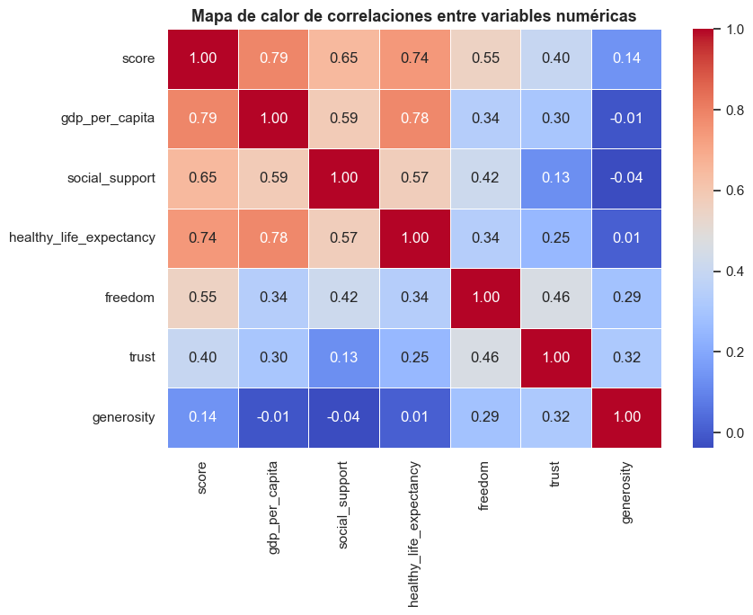
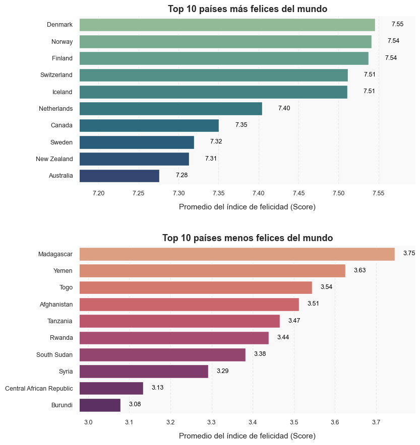
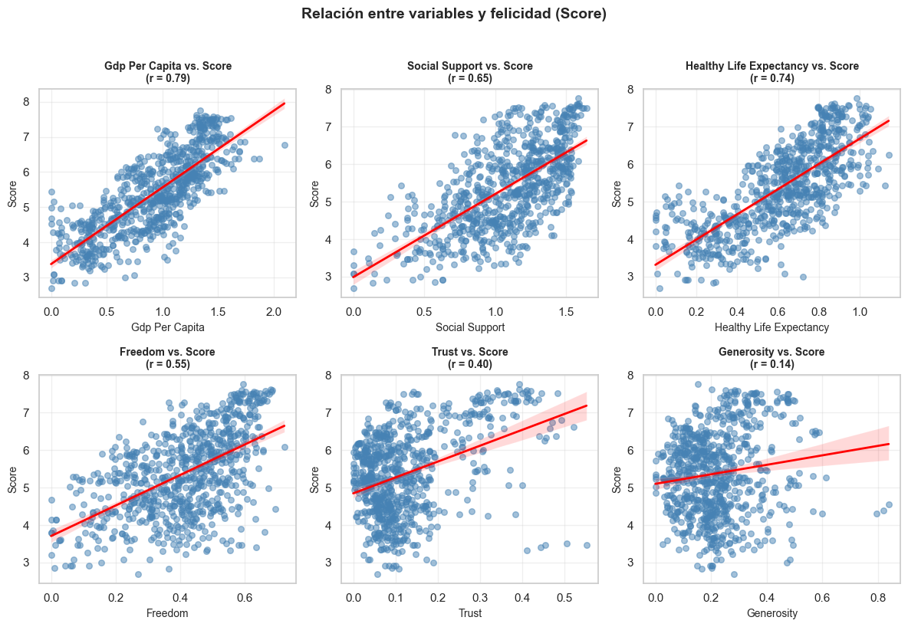

# 🌎 World Happiness Report – Exploratory Data Analysis (EDA)

# 🌎 World Happiness Report – Exploratory Data Analysis (EDA)
<!-- BADGES -->


## 🧾 DESCRIPTION / DESCRIPCIÓN

**EN:**  
This project explores the **World Happiness Report (2015–2019)** published by the United Nations, aiming to identify the main factors influencing countries’ happiness levels and visualize global trends over time.  
The analysis includes correlations between economic, social, and health variables, regional comparisons, and the evolution of global happiness scores.

**ES:**  
Este proyecto analiza el **World Happiness Report (2015–2019)** publicado por las Naciones Unidas, con el objetivo de identificar los principales factores que influyen en la felicidad de los países y visualizar las tendencias globales a lo largo del tiempo.  
El análisis incluye correlaciones entre variables económicas, sociales y de salud, comparaciones regionales y la evolución del índice global de felicidad.

---
## 🎯 OBJECTIVE / OBJETIVO

**EN:**  
To analyze how socioeconomic and emotional factors affect the **happiness index (Score)** and determine which variables contribute most to global well-being.

**ES:**  
Analizar cómo los factores socioeconómicos y emocionales afectan el **índice de felicidad (Score)** y determinar qué variables contribuyen más al bienestar global.

---**EN:**  
The dataset combines data from annual reports between **2015 and 2019**, containing the following variables:

| Variable | Description |
|-----------|-------------|
| `GDP per capita` | Economic wealth per person |
| `Social support` | Perceived community support |
| `Healthy life expectancy` | Expected years of healthy life |
| `Freedom` | Freedom to make life choices |
| `Trust` | Trust in government or institutions |
| `Generosity` | Level of social generosity |
| `Score` | Overall happiness index |

**ES:**  
El conjunto de datos combina los reportes anuales entre **2015 y 2019**, incluyendo las siguientes variables:

| Variable | Descripción |
|-----------|-------------|
| `GDP per capita` | Riqueza económica por persona |
| `Social support` | Apoyo social percibido |
| `Healthy life expectancy` | Años esperados de vida saludable |
| `Freedom` | Libertad para tomar decisiones |
| `Trust` | Confianza en el gobierno o instituciones |
| `Generosity` | Nivel de generosidad social |
| `Score` | Índice general de felicidad |

---
## ## ⚙️ PROCESS / PROCESO

**EN:**  
1. Data cleaning and normalization.  
2. Handling missing or inconsistent values.  
3. Merging data from different years.  
4. Statistical and correlation analysis.  
5. Visualization of insights and trends.

**ES:**  
1. Limpieza y normalización de los datos.  
2. Tratamiento de valores faltantes o inconsistentes.  
3. Integración de los datos de distintos años.  
4. Análisis estadístico y de correlaciones.  
5. Visualización de hallazgos y tendencias.

---
## ## 📊 FINDINGS / HALLAZGOS

**EN:**  
- **GDP per capita**, **Healthy life expectancy**, and **Social support** are the strongest predictors of happiness.  
- **Freedom** and **Trust** show moderate influence, while **Generosity** has weaker correlation.  
- **Nordic countries** consistently rank among the happiest nations.  
- **Sub-Saharan Africa** and **South Asia** show the lowest happiness levels.  
- Global happiness remained **stable between 2015–2019**.

**ES:**  
- El **PIB per cápita**, la **esperanza de vida saludable** y el **apoyo social** son los predictores más fuertes de felicidad.  
- La **libertad** y la **confianza** muestran una influencia moderada, mientras que la **generosidad** presenta una correlación débil.  
- Los **países nórdicos** se mantienen entre los más felices del mundo.  
- **África Subsahariana** y **Asia Meridional** presentan los niveles de felicidad más bajos.  
- La felicidad global se mantuvo **estable entre 2015 y 2019**.

---
## ## 📈 VISUALIZATIONS / VISUALIZACIONES

---

### 1️⃣ Correlation Heatmap / Mapa de calor de correlaciones


**EN:**  
Strong positive correlations appear between `GDP per capita`, `Healthy life expectancy`, and the overall `Score`.  
These three variables explain most of the global variation in happiness.

**ES:**  
Se observan correlaciones positivas fuertes entre el `PIB per cápita`, la `esperanza de vida saludable` y el índice general de felicidad (`Score`).  
Estas tres variables explican gran parte de la variación global de la felicidad.

---

### 2️⃣ Correlation Strength with Happiness / Fuerza de correlación con la felicidad


**EN:**  
Economic prosperity and health stand out as the main drivers of happiness.  
Generosity and trust play smaller roles, likely due to cultural rather than structural factors.

**ES:**  
La prosperidad económica y la salud destacan como los principales impulsores de la felicidad.  
La generosidad y la confianza tienen menor peso, probablemente por factores culturales más que estructurales.

---

### 3️⃣ Top 10 Happiest & Least Happy Countries / Top 10 países más y menos felices


**EN:**  
Nordic countries dominate the top rankings, reflecting high levels of equality, health, and social stability.  
In contrast, the least happy countries are mainly located in Africa and the Middle East.

**ES:**  
Los países nórdicos dominan los primeros lugares, reflejando altos niveles de equidad, salud y estabilidad social.  
En contraste, los países menos felices se concentran principalmente en África y Medio Oriente.

---

### 4️⃣ Global Happiness Trend (2015–2019) / Tendencia global de felicidad (2015–2019)


**EN:**  
Global happiness remained stable, with a slight increase after 2018.  
This indicates resilience in global well-being despite local fluctuations.

**ES:**  
La felicidad global se mantuvo estable, con un leve aumento después de 2018.  
Esto refleja la resiliencia del bienestar mundial frente a fluctuaciones locales.

---

### 5️⃣ Average Happiness by Region / Promedio de felicidad por región


**EN:**  
Oceania and North America lead global happiness, while Sub-Saharan Africa and South Asia show the lowest averages.  
Latin America maintains a middle position with consistent results.

**ES:**  
Oceanía y Norteamérica lideran los niveles de felicidad global, mientras que África Subsahariana y Asia Meridional presentan los promedios más bajos.  
América Latina mantiene una posición media con resultados consistentes.

---

### 6️⃣ Relationships Between Variables & Happiness / Relación entre variables y felicidad


**EN:**  
All variables show positive relationships with happiness, especially economic and health indicators, which display the strongest effects.

**ES:**  
Todas las variables muestran relaciones positivas con la felicidad, especialmente los indicadores económicos y de salud, que presentan los efectos más significativos.

---
## ## 🧠 CONCLUSION / CONCLUSIÓN

**EN:**  
Happiness depends on multiple interconnected factors — economic prosperity, health, social support, and freedom.  
Countries that promote equality and collective well-being achieve higher and more sustainable happiness levels.

**ES:**  
La felicidad depende de múltiples factores interconectados — prosperidad económica, salud, apoyo social y libertad.  
Los países que promueven la equidad y el bienestar colectivo logran niveles de felicidad más altos y sostenibles.

---
## ## 🧮 TECHNOLOGIES / TECNOLOGÍAS

- **Python 3.10+**  
- **Pandas**, **NumPy**, **Matplotlib**, **Seaborn**  
- **Jupyter Notebook**

---
## ## 👤 AUTHOR / AUTOR

**Cristian Salinas**  
Data Analyst | Business Intelligence | Strategic Planning  

🌐 [www.IngSalinas.com](https://www.ingsalinas.com)  
🔗 [LinkedIn](https://www.linkedin.com/in/tu-perfil) | [GitHub](https://github.com/IngSalinas)

---

## ## 🚀 HOW TO RUN / CÓMO EJECUTAR

```bash
# Clone repository
git clone https://github.com/IngSalinas/world-happiness-eda.git
cd world-happiness-eda

# Install dependencies
pip install -r requirements.txt

# Run notebook

jupyter notebook World_Happiness_EDA.ipynb


